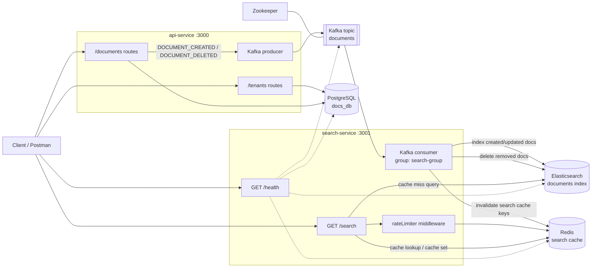

# Distributed Docs Service

A small distributed document metadata service built with Node.js, Express, PostgreSQL, Kafka, Elasticsearch, and Redis.

The project is split into two services:

- `api-service`: manages tenants and document metadata in PostgreSQL, then publishes document events to Kafka.
- `search-service`: consumes document events from Kafka, indexes documents into Elasticsearch, and exposes cached search APIs.

## Tech Stack

- Node.js + Express
- PostgreSQL + Sequelize
- Kafka + Zookeeper
- Elasticsearch
- Redis
- Docker Compose

## Project Structure

```text
distributed-docs-service/
  api-service/       # Tenant and document write/read API
  search-service/    # Kafka consumer, Elasticsearch search API, health checks
  docker-compose.yml # Local infrastructure and services
```

## Services

| Service | Port | Description |
| --- | --- | --- |
| API service | `3000` | Tenant and document CRUD APIs |
| Search service | `3001` | Search and health APIs |
| PostgreSQL | `5432` | Primary relational database |
| Kafka | `9092` | Document event stream |
| Redis | `6379` | Search cache and rate limiting support |
| Elasticsearch | `9200` | Document search index |

## Getting Started

### Prerequisites

- Docker and Docker Compose
- Node.js, if running services outside Docker

### Run with Docker

From the project root:

```bash
docker compose up --build
```

The services will start on:

- API service: `http://localhost:3000`
- Search service: `http://localhost:3001`

### Database Migrations

If running from docker, the migration will run automatically.

If you are running services locally then migrations need to run manually from inside `api-service`:

```bash
npm install
npm run migrate
```

The Docker Compose setup uses PostgreSQL with:

```text
DB_USER=postgres
DB_PASSWORD=password
DB_NAME=docs_db
DB_HOST=postgres
DB_PORT=5432
```

### Create Elasticsearch Index

If the `documents` index does not exist, create it from `search-service`:

```bash
npm install
npm run create:index
```

## Environment Variables

Each service loads `.env.docker` when `NODE_ENV=docker`, otherwise it loads `.env`.

Common variables:

```text
PORT=3000
DB_USER=postgres
DB_PASSWORD=password
DB_NAME=docs_db
DB_HOST=localhost
DB_PORT=5432
KAFKA_BROKER=localhost:9092
```

Search service also uses:

```text
PORT=3001
ELASTIC_URL=http://localhost:9200
REDIS_URL=redis://localhost:6379
```

When running inside Docker, service hostnames should use the Compose service names, for example `postgres`, `kafka:29092`, `redis`, and `elasticsearch`.

## Useful Commands

Start all services:

```bash
docker compose up --build
```

Stop all services:

```bash
docker compose down
```

Run API service locally:

```bash
cd api-service
npm install
npm run dev
```

Run search service locally:

```bash
cd search-service
npm install
npm run dev
```

## API Endpoints / Also added in postman collection docs.

### Tenants

Create a tenant:

```http
POST /tenants/register
```

Example body:

```json
{
  "first_name": "Rahul",
  "last_name": "Sharma",
  "email": "rahul@example.com"
}
```

Get all tenants:

```http
GET /tenants/getAll
```

Get one tenant:

```http
GET /tenants/:id
```

Update a tenant:

```http
PUT /tenants/:id
```

### Documents

Create a document:

```http
POST /documents
```

Example body:

```json
{
  "file_name": "invoice-april.pdf",
  "file_size": 204800,
  "file_type": "pdf",
  "tenant_id": 1
}
```

Get all documents:

```http
GET /documents
```

Filter documents by tenant:

```http
GET /documents?tenant_id=1
```

Get one document:

```http
GET /documents/:id
```

Delete a document:

```http
DELETE /documents/:id
```

### Search

Health check:

```http
GET /health
```

Search documents:

```http
GET /search?q=invoice&tenant_id=1
```

Supported query parameters:

- `q`: fuzzy search against `file_name`
- `file_name`: search by file name
- `tenant_id`: filter by tenant
- `id`: filter by document id

## Event Flow

1. A document is created or deleted through `api-service`.
2. `api-service` writes the change to PostgreSQL.
3. `api-service` publishes a document event to the Kafka `documents` topic.
4. `search-service` consumes the event.
5. `search-service` updates the Elasticsearch `documents` index.
6. Related Redis search cache entries are invalidated.

## Architecture diagram


